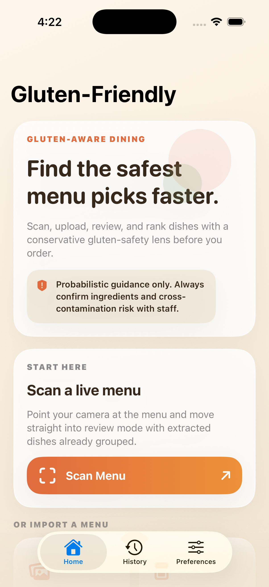
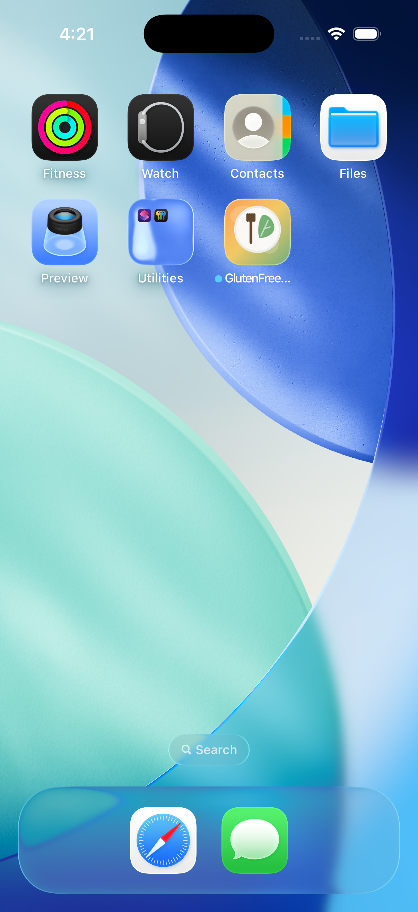

# GlutenScannerApp

GlutenScannerApp is a native SwiftUI iPhone app that helps people review restaurant menus through a conservative gluten-safety lens before they order.

The app lets users scan a live menu, upload a menu image or PDF, review extracted menu items, and sort dishes into three confidence tiers:

- `Definitely good`
- `Medium probability`
- `Might be good`

It also supports saved food preferences so users can surface dishes they are more likely to enjoy without letting preference override safety.

## Screenshots

| Home | App Icon |
| --- | --- |
|  |  |

## What It Does

- Scans live menus with VisionKit
- Imports menu photos and PDFs
- Extracts menu text with OCR and parses likely sections and dishes
- Applies a conservative gluten-risk rules engine
- Adds structured reasoning and confidence labels for each dish
- Lets users review and correct extracted items before analysis
- Saves recent sessions locally for quick recall
- Filters and ranks results based on cuisine and ingredient preferences

## Product Flow

1. Home
2. Scan or upload a menu
3. Review extracted dishes and correct OCR issues
4. See ranked gluten-friendlier options with preference-aware filtering

## Tech Stack

- SwiftUI
- Vision / VisionKit
- PDFKit
- Swift Package Manager
- Local JSON persistence for session history and preferences

## Project Structure

```text
GlutenFreeScannerApp/   SwiftUI app, screens, design system, services
Sources/GlutenFreeCore/ Shared parsing, scoring, models, matching logic
Tests/GlutenFreeCoreTests/ Core analysis and parsing tests
```

## Running Locally

### Requirements

- Xcode 26+
- iOS Simulator target for iPhone

### Open and run

1. Open `GlutenFreeScanner.xcodeproj` in Xcode.
2. Select the `GlutenFreeScanner` scheme.
3. Choose an iPhone simulator.
4. Build and run.

### Command line build

```bash
xcodebuild -project GlutenFreeScanner.xcodeproj -scheme GlutenFreeScanner -destination 'generic/platform=iOS Simulator' build
```

### Core tests

```bash
swift test --scratch-path .build
```

## Safety Note

This app provides probabilistic guidance, not medical advice. Menu descriptions can be incomplete, OCR can be imperfect, and cross-contamination risk often cannot be confirmed from a menu alone.

Users should still verify ingredients and preparation details with restaurant staff.

## Status

This is an MVP-quality prototype focused on a clear end-to-end iPhone experience:

- modern SwiftUI interface
- conservative gluten-oriented scoring
- local-first storage
- simulator-tested build path

## Repository

- GitHub: [ksanjay/GlutenScannerApp](https://github.com/ksanjay/GlutenScannerApp)
